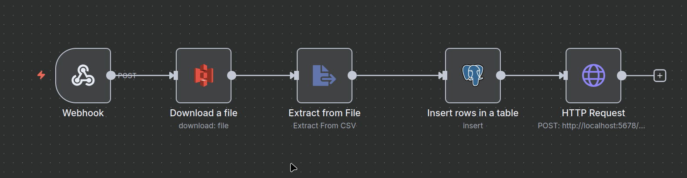
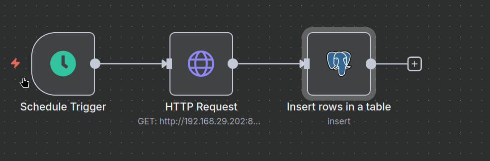
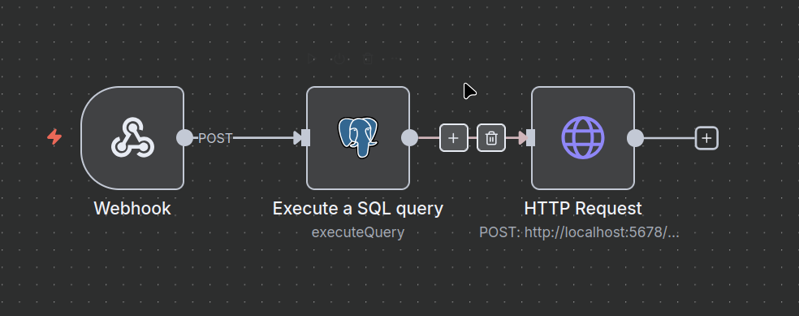

# 🏦 Loan Eligibility Engine

A full-stack system that automates user-to-loan product matching using AWS and open-source tooling. This solution enables CSV-based user uploads, intelligent loan filtering, and personalized email notifications — all driven by serverless architecture and workflow automation.

---

## 📌 Features

- Upload user data via a Django web interface
- Store user CSVs in AWS S3
- Trigger AWS Lambda on upload
- Insert user data into PostgreSQL via n8n (Workflow A)
- Scrape PolicyBazaar for loan product details and insert into PostgreSQL (Workflow B)
- Match users with loan products (Workflow C)
- Email matched users with eligible loan offers (Workflow D)
- Fully self-hosted via Docker and PostgreSQL
- Configurable and extendable with rule-based filters and optional LLM logic

---

## 🧱 Architecture Overview

```mermaid
graph TD
    A[Django Web UI] -->|Upload CSV| B[S3 Bucket]
    B -->|Trigger| C[AWS Lambda]
    C -->|Webhook Call| D[n8n Workflow A: Insert Users]
    D -->|Webhook Call| E[n8n Workflow B: Insert Loan Products]
    E -->|Webhook Call (Daily 8pm)| F[n8n Workflow C: Match Loans]
    F -->|Webhook Call| G[n8n Workflow D: Email User]
    G -->|Email| H[AWS SES]
```

### 📥 Workflow A: CSV Upload & Ingestion


### 📥 Workflow B: Scrape and Insert Loan Products


### 📥 Workflow C: Match Users and Loan Products


### 📥 Workflow D: User Email Notification


---

## 📊 Example Query: Get Users and Their Matched Loans (Last 24h)

```sql
SELECT
  u.user_id,
  u.name,
  u.email,
  STRING_AGG(
    l.bank_name || ' - ' || l.product_name || 
    ' (' || l.interest_rate_min || '% - ' || l.interest_rate_max || '%)',
    E'\n• '
  ) AS matched_loans
FROM
  matches m
JOIN users u ON m.user_id = u.user_id
JOIN loan_products l ON m.product_id = l.id
WHERE
  m.created_at >= NOW() - INTERVAL '1 day'
GROUP BY
  u.user_id, u.name, u.email;
```

---

## 🚀 Quickstart: n8n Docker Compose

```yaml
services:
  n8n:
    image: n8nio/n8n
    ports:
      - "5678:5678"
    environment:
      - DB_TYPE=postgresdb
      - DB_POSTGRESDB_HOST=${DB_HOST}
      - DB_POSTGRESDB_PORT=5432
      - DB_POSTGRESDB_DATABASE=${DB_NAME}
      - DB_POSTGRESDB_USER=${DB_USER}
      - DB_POSTGRESDB_PASSWORD=${DB_PASSWORD}
      - DB_POSTGRESDB_SSL_REJECT_UNAUTHORIZED=false
    volumes:
      - ./n8n_data:/home/node/.n8n
```

Start the stack:

```bash
docker-compose up -d
```

---

## 🔧 Infrastructure Notes

### 📡 Webhook Tunneling with Ngrok

During local development and testing, we used [ngrok](https://ngrok.com/) to expose the Django server’s webhook endpoints to the internet so that:

- AWS Lambda could notify n8n via HTTP.
- n8n workflows (triggered via webhook) were accessible from Lambda or external services.

> **Important:** If you restart ngrok, the URL changes. Be sure to update your webhook URLs in AWS Lambda environment variables or n8n trigger nodes accordingly.

**Example:**

```bash
ngrok http 5678
# → https://c2a1-182-75-xxx-xxx.ngrok.io
```

---

### ☁️ Serverless Framework (sls)

We used the [Serverless Framework](https://www.serverless.com/) to deploy AWS Lambda functions that act as a bridge between:

- 📥 The S3 bucket (on CSV upload)
- 📬 The n8n webhook endpoints
- 🧠 The PostgreSQL data processing pipeline

---

### 🔌 Lambda Use Cases

- On CSV upload, S3 triggers Lambda → Lambda sends webhook payload to n8n (Workflow A).
- Lambda is configured with environment variables for:
  - n8n webhook URLs
  - AWS region
  - IAM permissions for S3 + SES

---

## 📚 Notes
- Ensure your AWS RDS/PostgreSQL instance allows inbound connections from your Docker host.
- Update your `.env` file with the correct database and AWS credentials.
- For production, restrict security group access and use SSL certificates for database connections.

---

## 🤝 Contributing
Pull requests and suggestions are welcome! For major changes, please open an issue first to discuss what you would like to change.

---

## 📝 License
MIT