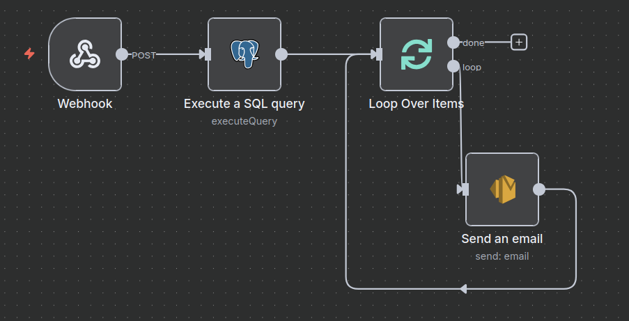

# 🏦 Loan Eligibility Engine

A full-stack system that automates user-to-loan product matching using AWS and open-source tooling. This solution enables CSV-based user uploads, intelligent loan filtering, and personalized email notifications — all driven by serverless architecture and workflow automation.

---

## 📌 Features

- Upload user data via a Django web interface
- Store user CSVs in AWS S3
- Trigger AWS Lambda on upload
- Insert user data into PostgreSQL via n8n (Workflow A)
- Scrape PolicyBazaar for loan product details and insert into PostgreSQL (Workflow B)
- Match users with loan products (Workflow C)
- Email matched users with eligible loan offers (Workflow D)
- Fully self-hosted via Docker and PostgreSQL
- Configurable and extendable with rule-based filters and optional LLM logic

---

## 🧱 Architecture Overview

```text
[Django Web UI]
    ↓ (Upload CSV)
[S3 Bucket]
    ↓ (Trigger)
[AWS Lambda]
    ↓ (Webhook Call)
[n8n Workflow A: Insert Users]
    ↓ (Webhook Call)
[n8n Workflow B: Insert loan_products] 
    ↓ (Webhook Call - Runs daily at 8pm)
[n8n Workflow C: Match Loans]
    ↓ (Webhook Call)
[n8n Workflow D: Email User]
      ↳ [AWS SES]
```

### 📥 Workflow A: CSV Upload & Ingestion


### 📥 Workflow B: Scrape and Insert Loan Products


### 📥 Workflow C: Match Users and Loan Products


### 📥 Workflow D: User Email Notification


---

## 🎥 Demo Video

Watch a walkthrough of the Loan Eligibility Engine in action:

[](https://drive.google.com/file/d/1v91ZcVEHaIwlhbNg4eDgbjInVTPj_xY_/view?usp=drive_link)

---

## 📊 Example Query: Get Users and Their Matched Loans (Last 24h)

```sql
SELECT
  u.user_id,
  u.name,
  u.email,
  STRING_AGG(
    l.bank_name || ' - ' || l.product_name || 
    ' (' || l.interest_rate_min || '% - ' || l.interest_rate_max || '%)',
    E'\n• '
  ) AS matched_loans
FROM
  matches m
JOIN users u ON m.user_id = u.user_id
JOIN loan_products l ON m.product_id = l.id
WHERE
  m.created_at >= NOW() - INTERVAL '1 day'
GROUP BY
  u.user_id, u.name, u.email;
```

---

## 🧮 Example: Matching Users to Top 3 Loan Products

This SQL statement inserts the top 3 eligible loan products for each user into the `matches` table. It uses a Common Table Expression (CTE) to rank loan products for each user based on the minimum income requirement, ensuring that users are matched with the most accessible loans first.

```sql
INSERT INTO matches (user_id, product_id)
WITH matched_pairs AS (
  SELECT
    u.user_id,
    l.id AS product_id,
    ROW_NUMBER() OVER (
      PARTITION BY u.user_id
      ORDER BY l.min_income_monthly ASC
    ) AS rank
  FROM users u
  JOIN loan_products l
    ON u.monthly_income >= l.min_income_monthly
    AND u.credit_score >= l.min_credit_score
    AND u.age BETWEEN 21 AND 60
    AND u.employment_status IN ('Salaried', 'Self-Employed')
)
SELECT user_id, product_id
FROM matched_pairs
WHERE rank <= 3;
```

**Explanation:**
- The `matched_pairs` CTE finds all loan products each user is eligible for, based on income, credit score, age, and employment status.
- `ROW_NUMBER() OVER (PARTITION BY u.user_id ORDER BY l.min_income_monthly ASC)` ranks the loans for each user, prioritizing those with the lowest income requirement (i.e., most accessible).
- The final `SELECT` picks only the top 3 ranked products per user.
- The result is inserted into the `matches` table, so each user is matched with up to three best-fit loan products.

---

## 🚀 Quickstart: n8n Docker Compose

```yaml
services:
  n8n:
    image: n8nio/n8n
    ports:
      - "5678:5678"
    environment:
      - DB_TYPE=postgresdb
      - DB_POSTGRESDB_HOST=${DB_HOST}
      - DB_POSTGRESDB_PORT=5432
      - DB_POSTGRESDB_DATABASE=${DB_NAME}
      - DB_POSTGRESDB_USER=${DB_USER}
      - DB_POSTGRESDB_PASSWORD=${DB_PASSWORD}
      - DB_POSTGRESDB_SSL_REJECT_UNAUTHORIZED=false
    volumes:
      - ./n8n_data:/home/node/.n8n
```

Start the stack:

```bash
docker-compose up -d
```

---

## 🔧 Infrastructure Notes

### 📡 Webhook Tunneling with Ngrok

During local development and testing, we used [ngrok](https://ngrok.com/) to expose the Django server’s webhook endpoints to the internet so that:

- AWS Lambda could notify n8n via HTTP.
- n8n workflows (triggered via webhook) were accessible from Lambda or external services.

> **Important:** If you restart ngrok, the URL changes. Be sure to update your webhook URLs in AWS Lambda environment variables or n8n trigger nodes accordingly.

**Example:**

```bash
ngrok http 5678
# → https://c2a1-182-75-xxx-xxx.ngrok.io
```

---

### ☁️ Serverless Framework (sls)

We used the [Serverless Framework](https://www.serverless.com/) to deploy AWS Lambda functions that act as a bridge between:

- 📥 The S3 bucket (on CSV upload)
- 📬 The n8n webhook endpoints
- 🧠 The PostgreSQL data processing pipeline

---

### 🔌 Lambda Use Cases

- On CSV upload, S3 triggers Lambda → Lambda sends webhook payload to n8n (Workflow A).
- Lambda is configured with environment variables for:
  - n8n webhook URLs
  - AWS region
  - IAM permissions for S3 + SES

---

## 📚 Notes
- Ensure your AWS RDS/PostgreSQL instance allows inbound connections from your Docker host.
- Update your `.env` file with the correct database and AWS credentials.
- For production, restrict security group access and use SSL certificates for database connections.

---

## 🤝 Contributing
Pull requests and suggestions are welcome! For major changes, please open an issue first to discuss what you would like to change.

---

## 📝 License
MIT